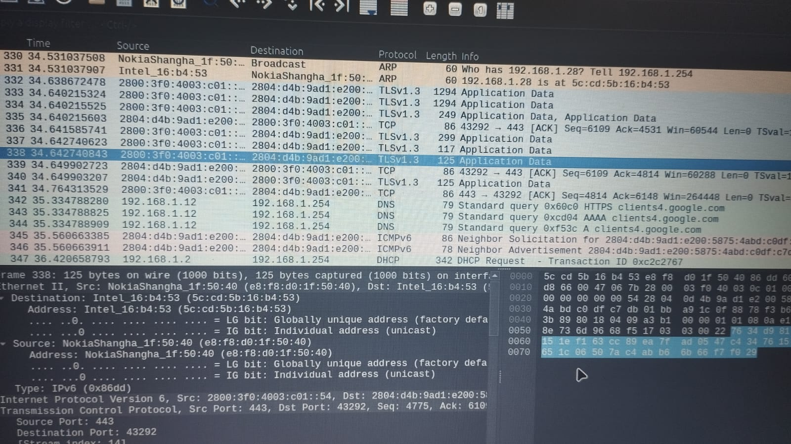
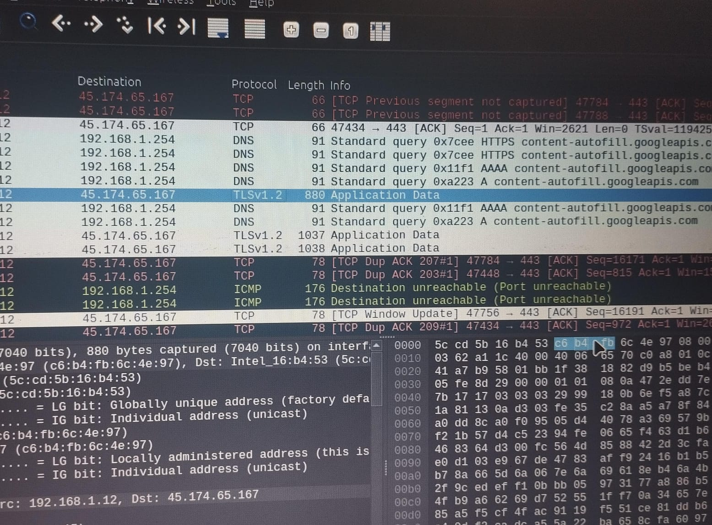
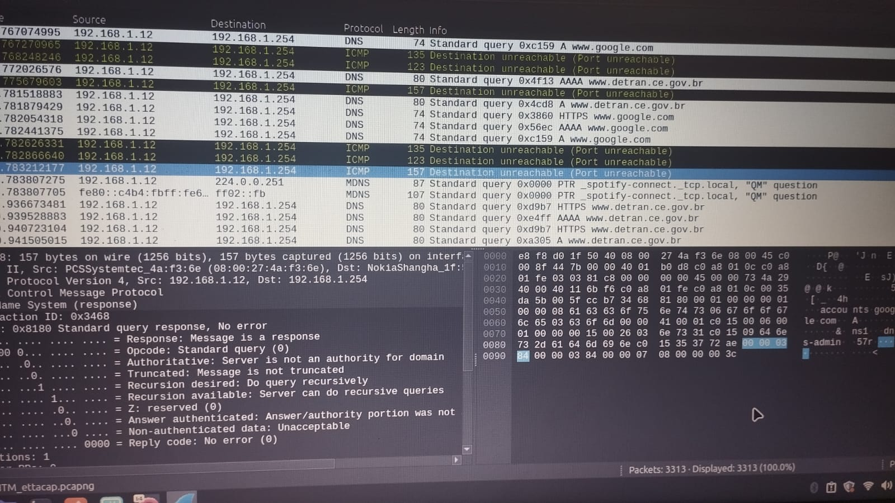
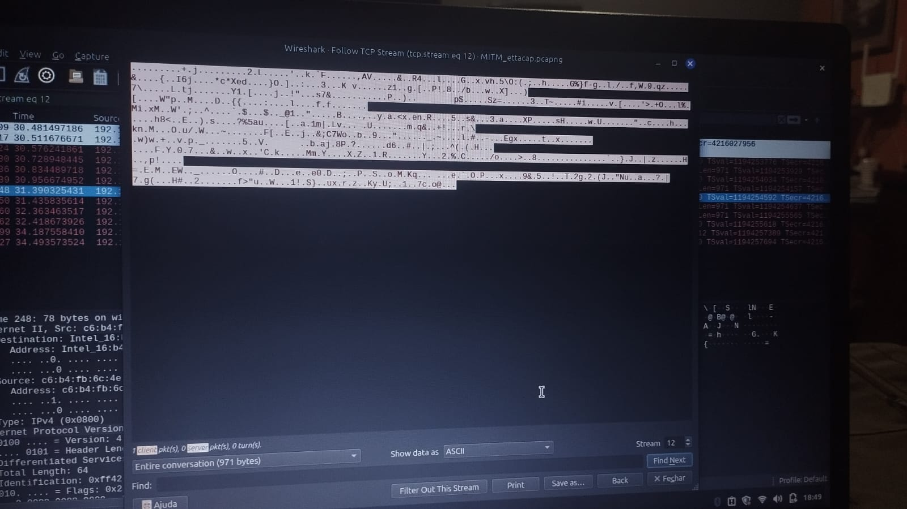
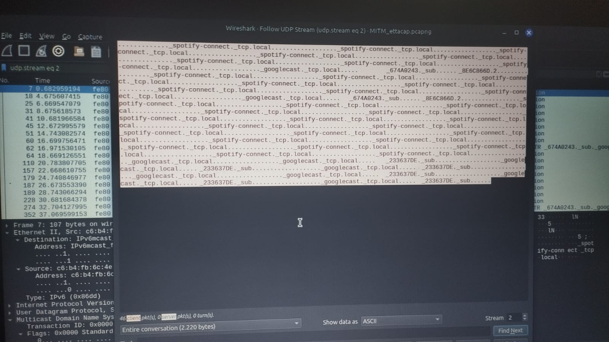
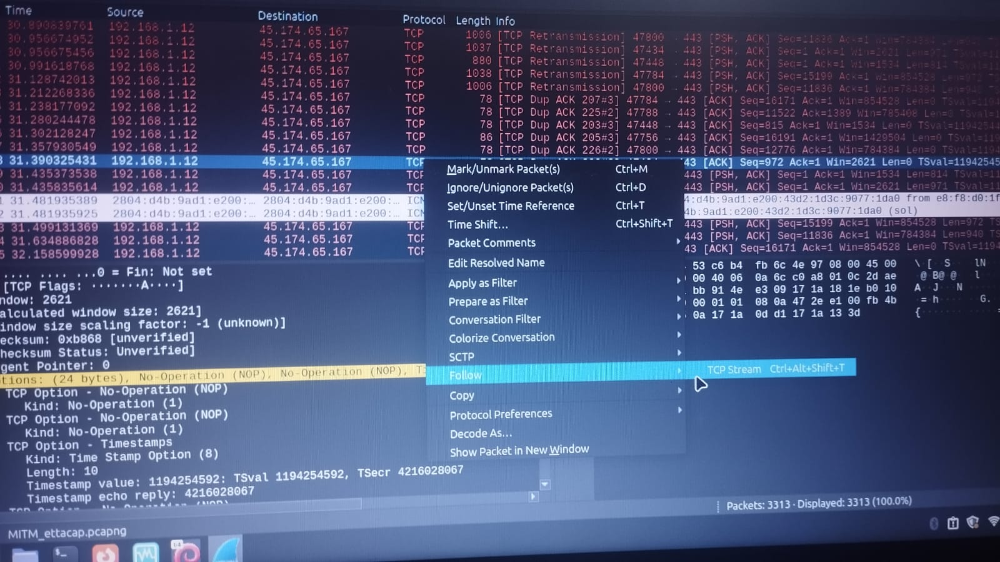
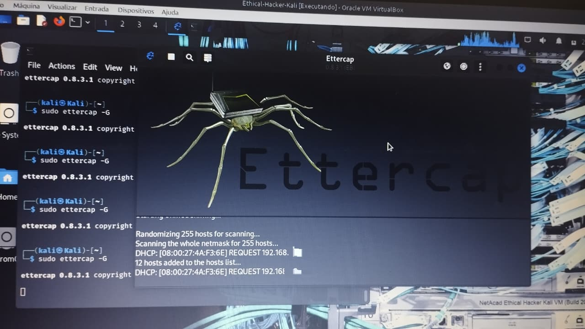
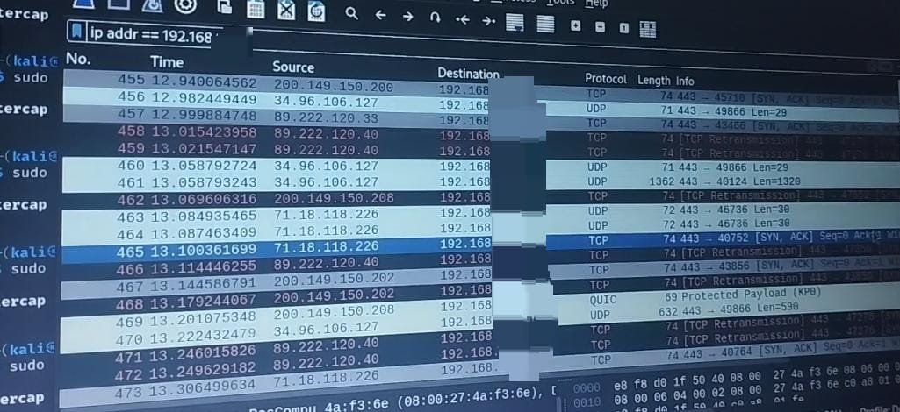

# 🛡️ Projeto de Cibersegurança
>1° parte
# 💡 Simulação de Ataque MITM e Análise de Tráfego de Rede
   ## **Objetivo do projeto**
Tenho como objetivo explorar vulnerabilidades de certificados e criptografia (SSL/TLS) e demonstrar a importância da utilização de defesa em profundidade, ao colocar camadas de segurança para diminuir os riscos de ataques como MITM e Brute Force, por meio da exploração das vulnerabilidades e ataques em ambientes controlados.

A primeira parte desse projeto demonstra a execução de um ataque **Man-in-the-Middle (MITM)** via **ARP Spoofing** com a ferramenta **Ettercap** e a análise detalhada dos pacotes capturados em diferentes cenários (Web, Apps e Serviços Governamentais) com a ferramenta **Wireshark**. Também será apresentada a análise dos dados obtidos e aplicação prática da criptografia dos serviços utilizados. Vou deixar registrado por meio de imagens e arquivos .docs e .pcapng.

---

## 🛠️ Tecnologias e Ferramentas
*   **Ambiente Virtual:** Kali Linux (Atacante) em modo Bridge;
*   **Interceptação:** Ettercap com ARP Spoofing;
*   **Análise de Protocolos:** Wireshark - TCP e UDP Stream.

---

## 🚀 O que foi realizado?

### 1. Identificação de alvo e interceptação de tráfego
Utilizei o **Ettercap** para envenenar a tabela ARP do alvo (celular) e do gateway, posicionando minha máquina como intermediária. O tráfego foi capturado e filtrado no **Wireshark**.

## 🔐 Passo a Passo
1. Configurei a VM em **Modo Bridge** para obter um IP na rede real e configurei sua placa para modo promíscuo.

2. Ativei o **IP Forwarding** no Kali para manter a conexão do alvo ativa e permitir que o mesmo se passasse por roteador de modo invisível.

3. Utilize o **Ettercap** para escanear os hosts e definir o Gateway (Target 1) e o Celular (Target 2).

4. Iniciei o **ARP Poisoning** do modo **MITM** para redirecionar o tráfego.

5. Capturei os pacotes no **Wireshark** , posteriormente filtrando pelo IP do alvo.

### 2. 🫆 Análise de Alvos Específicos
Durante a captura, analisei o comportamento de diferentes serviços:
*   **WhatsApp/Instagram:** Verifiquei a presença de protocolos **TLS/QUIC** e tráfego de dados de aplicação (Application Data). O conteúdo permaneceu criptografado, validando a segurança desses apps.

*   **Spotify:** Identifiquei conexões via **TCP** e consegui ver de maneira clara o tráfego como *spotify-connect._tcp.local*

*   **nmap.org & detran.ce.gov.br:** Analisei requisições **HTTP/DNS** e a estrutura de pacotes TCP (Handshake).

*   Também consegui visualizar requisições HTTP e DNS em texto claro de outro site, provando a vulnerabilidade do mesmo sem criptografia (**SSL/TLS**).

## 📊 Análise de Tráfego Avançada

Além de capturar requisições HTTP e DNS, a análise no Wireshark revelou:

* **Tráfego TCP:** Identifiquei o "Three-Way Handshake" (SYN, SYN-ACK, ACK) estabelecendo conexões entre o celular e servidores externos, confirmando a integridade do fluxo de dados interceptado.

    * *Nota técnica:* Diferente de algumas aplicações simples, o WhatsApp e Instagram utilizam criptografia (TLS/SSL). No Wireshark, observei pacotes do tipo **Application Data**, o que demonstra que, embora o conteúdo esteja protegido, o atacante ainda consegue mapear para quais servidores o host está se conectando.

---
## 📸 Evidências da Interceptação Técnica

Abaixo estão as capturas detalhadas realizadas durante o ataque MITM, organizadas por tipo de tráfego:

### 1. Análise de Criptografia e Protocolos Seguros
Neste cenário, observamos como o TLS protege os dados, mesmo com a interceptação ativa.
*   **Tráfego WhatsApp:** 

*   **Protocolo TLS (Geral):** 

*   
### 2. Estudo de Caso: Spotify e Detran.ce.gov (TCP Stream)
Aqui realizei uma comparação real entre o tráfego cifrado e a tentativa de leitura dos dados via Stream.
*   **Tráfego Geral do Spotify e acesso ao site do detran.ce:** 

*   **Google (Tráfego Cifrado):** 

*   **Análise de Conteúdo (TCP Stream):** 
    * *Nota: Através do "Follow TCP Stream", foi possível analisar a estrutura dos pacotes, evidenciando onde a criptografia impede a leitura de dados sensíveis.*

### 3. Visão Geral do Ataque
*   **Painel de Interceptação:** 
    * *Legenda: Fluxo de pacotes do alvo sendo redirecionado para a máquina atacante (Kali Linux).*

---

## 📸 Evidências da Interceptação

Abaixo estão as capturas de tela que comprovam a eficácia do ataque e a análise do tráfego:

### 1. Envenenamento ARP (Ettercap)
<table align="center">
  <tr>
    <td align="center">
       
      <b>Envenenamento Arp na rede </b>
    </td>
    <td align="center">
       
      <b>Ettercap buscando hosts </b>
    </td>
  </tr>
</table>

*Legenda: Configuração de alvos (Target 1 e 2) no Ettercap.*

### 2. Captura de Tráfego (Wireshark)

*Legenda: Filtro aplicado para o IP do celular, mostrando pacotes HTTP e DNS.*

### 3. Análise de Apps (WhatsApp/Instagram)

*Legenda: Tráfego cifrado via TLS/QUIC, garantindo a privacidade dos dados.*

## 🎓 Conclusão
O projeto evidenciou que, embora o ataque MITM seja eficaz para interceptar pacotes, a adoção massiva de **HTTPS** e criptografia de ponta a ponta protege o conteúdo da mensagem. Este estudo reforça a importância de protocolos de segurança em camadas.

---
**Desenvolvido por Laura Naiane** 🚀
